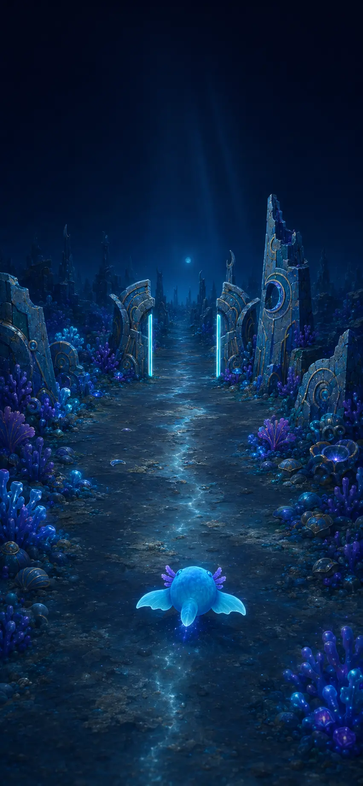

# ADR-0017: Authored visual sources before production GLBs

## Status

Accepted on draft PR #7 for visual review. Not approved for merge.

## Context

The owner-rejected evidence was not a lighting bug. It exposed a production
strategy error:

- generated paving read as a flat modern road
- box/extrusion ruins had no sculpted material or silhouette hierarchy
- cone-like coral read as neon debug geometry
- detached white clearance bars overwhelmed the wall masses
- the pale creature lacked the approved rounded blue body, readable eyes and
  manta-fin character

Increasing scene luminance made these defects easier to see. It did not bring
the frame closer to the Concept-First Art Bible.

## Decision

1. Keep PR #7 draft and never merge it solely because technical checks pass.
2. Treat the approved Art Bible and
   `art/phase3b-moon-garden-acceptance-target.webp` as the in-camera visual
   acceptance target.
3. Remove generated road paving from the active shader and use an authored
   organic gravel/silt Moon-Garden seabed surface at
   `public/art/moon-garden/moonstone-seabed.webp`.
4. Replace the active generated broken-tower and coral silhouettes with
   authored, instanced review impostors packed into one runtime material:
   - `public/art/moon-garden/review-atlas.webp`
   - `art/phase3b-broken-tower-source.webp`
   - `art/phase3b-coral-cluster-source.webp`
5. Replace the rejected pale generated creature in the review frame with the
   approved authored rear silhouette at
   `public/art/moon-garden/glowfin-rear.webp`, while its final rigged GLB is
   modeled. The deterministic rig remains the animation-state prototype.
6. Keep those impostors explicitly classified as temporary review assets in
   the structural gate. Their texture memory and compressed payload are
   measured; they are not reported as production GLBs.
7. Preserve deterministic collision planes and the independent straight cyan
   playable contour.
8. Require final modeled, UV-authored, optimized GLB replacements before
   Phase 3B can be called game-ready.

## Acceptance target

The target establishes composition, hierarchy, silhouette, material language
and atmosphere. It does not change the deterministic collider or authorize
painted false clearance.

## Consequences

- The live draft can be reviewed against recognizable authored art instead of
  abstract primitive stand-ins.
- The branch incurs about 9 MB of decoded texture memory and 0.13 MB of
  compressed runtime art payload, both below the Phase 3 budgets.
- Review impostors are camera-dependent and cannot ship as final 3D assets.
- The next production order is Glowfin, gate/wall fragment, broken tower,
  reef cluster, then background spire/kelp.
- A green beauty/contrast artifact remains necessary but is never sufficient
  without owner visual approval.
